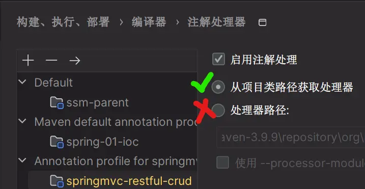

## 介绍

本仓库是个人在学习[黑马程序员SpringBoot3+Vue3全套视频](https://www.bilibili.com/video/BV14z4y1N7pg/?share_source=copy_web&vd_source=b91af0127331bb4444b9388984a23393)的代码及笔记。以及收集跟随视频教程学习中，容易踩的坑，希望对所有学习者有所帮助。

## 笔记

### Lombok 错误

运行项目，出现如下的@Data注解报错

```shell
java: 找不到符号
  符号:   方法 getPassword()
  位置: 类型为org.example.bigevent.pojo.User的变量 loginUser
```

可以检查IDEA的设置，`构建、执行、部署〉编译器〉注解处理器` 使用 `处理器路径` 将会报错。应设置为从项目类路径获取处理器。



疑惑的点是，在修改之后的某次运行项目，这个设置可能会被莫名其妙的恢复，再次导致错误，需要重新设置。

### Pagehelper 错误

跟随视频教程，在`UserController`中添加了分页功能，但是运行项目，出现Result类型推断错误。

修改如下，添加`PageInfo`

```java
    @Override
    public PageBean<Article> list(Integer pageNum, Integer pageSize, Integer categoryId, String state) {
        // 创建 PageBean 对象
        PageBean<Article> pageBean = new PageBean<>();

        // 开始分页
        PageHelper.startPage(pageNum, pageSize);

        // 获取当前线程的用户 ID
        Map<String, Object> map = ThreadLocalUtil.get();
        Integer userId = (Integer) map.get("id");

        // 查询文章列表
        List<Article> articles = articleMapper.list(userId, categoryId, state);

        // 获取分页信息
        PageInfo<Article> pageInfo = new PageInfo<>(articles);

        // 设置总记录数和分页数据
        pageBean.setTotal(pageInfo.getTotal());
        pageBean.setItems(pageInfo.getList());

        return pageBean;
    }
```